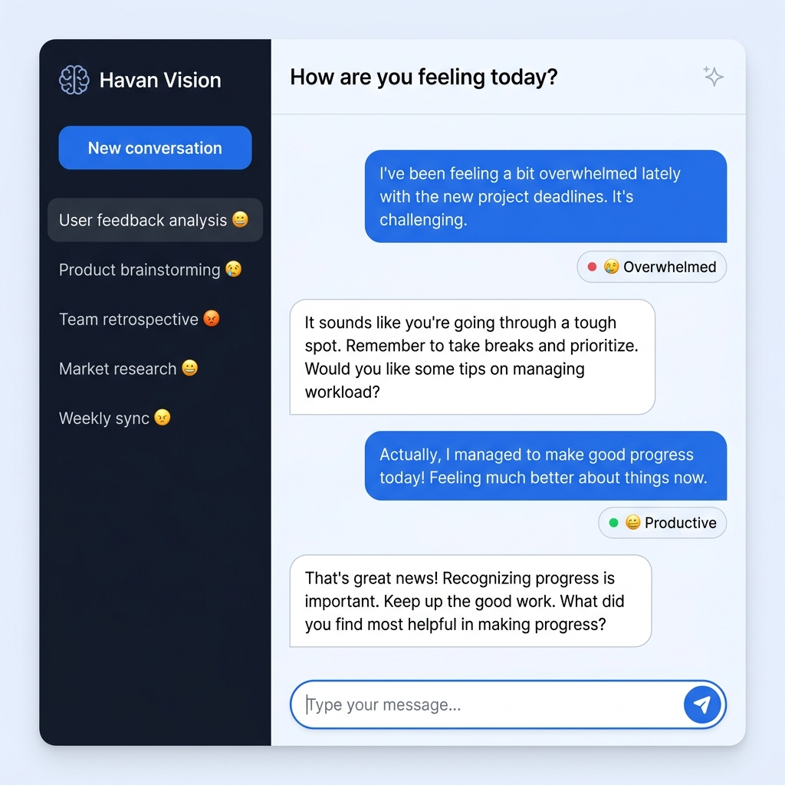
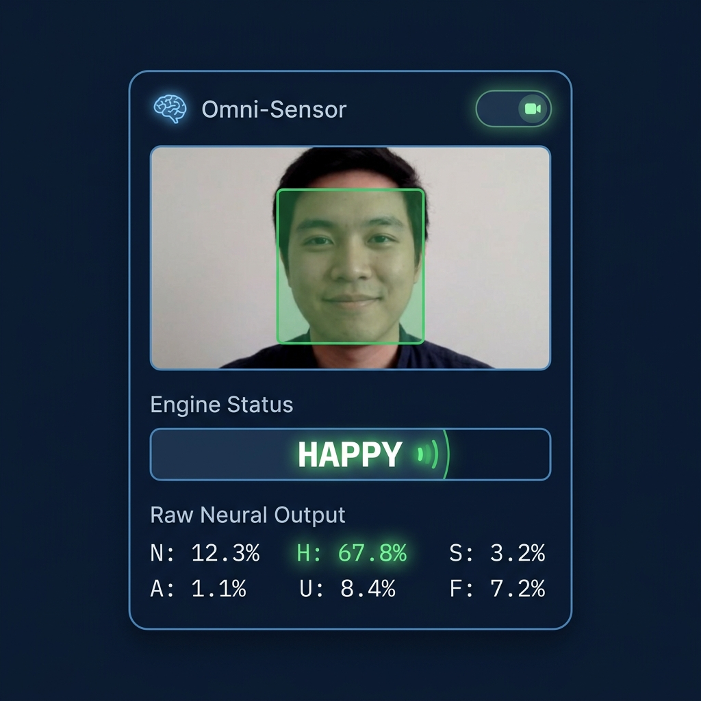
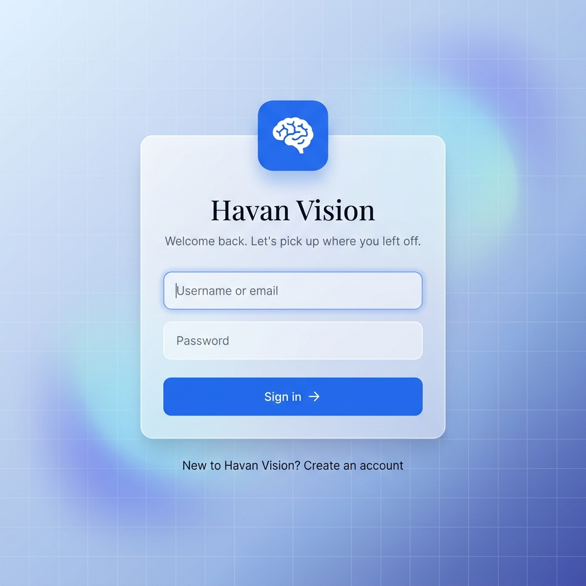

# Havan Vision 🧠💬



Havan Vision is an emotion-aware AI chat assistant that fuses Natural Language Processing (NLP) with real-time facial telemetry to give Large Language Models genuine emotional context about the user.

By combining text sentiment analysis with a client-side Webcam Neural Net (SSD MobileNet V1), Havan Vision understands not just *what* you are saying, but *how* you are feeling while you type it.

<div align="center">
  
  
</div>

## ✨ Key Features
- **Real-Time Visual Telemetry:** Client-side facial expression analysis using `face-api.js` (MobileNet V1).
- **Composite Emotional Profiling:** Fuses transformer-based text sentiment analysis with visual telemetry for high-accuracy state detection.
- **Crisis Interception:** Hard-coded rule-engine intercepts critical emotional states (e.g., severe distress) bypassing the LLM to provide immediate crisis resources.
- **Empathetic AI Engine:** Groq API powered LLaMA 3 model dynamically shifts its conversational tone based on the user's emotional state.
- **Secure Authentication:** JWT-based stateless authentication with robust session management.

## 🏗 Architecture
* **Frontend:** React 19, Vite, TailwindCSS (Glassmorphism & Aurora UI).
* **Backend:** Flask Application Factory, SQLAlchemy 2.x, JWT Extended.
* **AI Engine:** Groq API (LLaMA 3 8B) for chat, HuggingFace transformers (`j-hartmann/emotion-english-distilroberta-base` for emotion, `cardiffnlp/twitter-roberta-base-sentiment-latest` for sentiment) with an automatic lightweight rule-based fallback when ML models are disabled, plus a keyword-based Safety Crisis Interceptor.

---

## 🚀 Quick Start

### 1. Clone the repo
```bash
git clone https://github.com/Madhavan-dev18/havan-vision.git
cd havan-vision
```

### 2. Backend Setup
```bash
cd backend
python -m venv venv
# Windows: venv\Scripts\activate | macOS/Linux: source venv/bin/activate
pip install -r requirements.txt
cp .env.example .env   # Edit .env with your real keys
python run.py
```

### 3. Frontend Setup
```bash
cd frontend
npm install
npm run dev
```

---

## 🚀 Critical Setup: Facial Recognition Models
Because neural network weights are too large for standard Git repositories, **you must download the model files manually** before the frontend visual scanner will work.

1. Download the following shards from the official `@vladmandic/face-api` [model repository](https://github.com/vladmandic/face-api/tree/master/model):
   * `ssd_mobilenetv1_model-weights_manifest.json`
   * `ssd_mobilenetv1_model-shard1` & `shard2`
   * `face_expression_model-weights_manifest.json`
   * `face_expression_model-shard1`
2. Place all downloaded files inside the `frontend/public/models/` directory.

> **Note:** The app also loads models from the jsDelivr CDN as a fallback, so local models are optional for development.

---

## ⚙️ Environment Variables

### Backend (`backend/.env`)
```env
FLASK_ENV=development         # Use 'production' on live server
SECRET_KEY=your_secret_key
DATABASE_URL=sqlite:///havanvision.db
GROQ_API_KEY=gsk_your_groq_key
JWT_SECRET_KEY=your_jwt_secret
ALLOWED_ORIGINS=http://localhost:5173  # Production: https://your-vercel-app.vercel.app
USE_ML_MODELS=false           # Set to true only if running locally with heavy PyTorch/transformers (~1GB+ RAM); otherwise uses the lightweight rule-based fallback
```

---

## 🧪 Running Tests

### Backend
```bash
cd backend
python -m pytest tests/ -v
```

### Frontend
```bash
cd frontend
npm test
```

---

## 📄 License
MIT